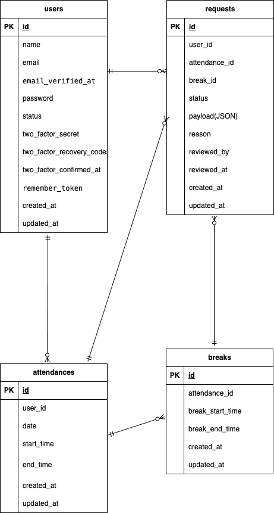

# employee-attendance-app

## 環境構築

### Docker ビルド
1. git clone https://github.com/irokiyo/employee-attendance-app.git attendance-clone  
1. cd market-clone  
1. docker-compose up -d --build  

### Laravel 環境構築

1. docker-compose exec php bash  
1. composer install  
1. cp .env.example .env  
1. .env ファイルの一部を以下のように編集
```
    DB_CONNECTION=mysql  
    DB_HOST=mysql  
    DB_PORT=3306  
    DB_DATABASE=laravel_db  
    DB_USERNAME=laravel_user  
    DB_PASSWORD=laravel_pass  
```
6. docker-compose exec php bash  
1. php artisan key:generate  
1. php artisan migrate:fresh  
1. php artisan db:seed  
1. php artisan storage:link  

## メール認証(MailHog)
メール認証はMailHogを使用しています  

### MailHog 環境構築  

1. .envに以下を追加する
```
MAIL_MAILER=smtp  
MAIL_HOST=mailhog  
MAIL_PORT=1025  
MAIL_USERNAME=null  
MAIL_PASSWORD=null  
MAIL_ENCRYPTION=null  
MAIL_FROM_ADDRESS=test@example.com  
MAIL_FROM_NAME="${APP_NAME}"  
```
1. docker-compose down
1. docker-compose up -d
1. docker-compose exec php bash
1. php artisan config:clear


## ログイン用初期データ  
-一般ユーザー
- メールアドレス: reina.n@coachtech.com  
- パスワード: password  
-管理者
- メールアドレス: norio.n@coachtech.com  
- パスワード: password  

## 使用技術
- MySQL 8.0.26  
- Laravel: 8.83.3  
- PHP 8.1 (Docker)  
- MailHog (ローカル開発用)  

## テスト・品質管理
- PHPUnit（Feature Test）
- PHPStan（静的解析）
- PHPCS（コーディング規約チェック）
- GitHub Actions（CI）

## URL
- 環境開発: http://localhost/  
- phpMyAdmin: http://localhost:8080/  
- MailHog: http://localhost:8025/  


## ER 図

